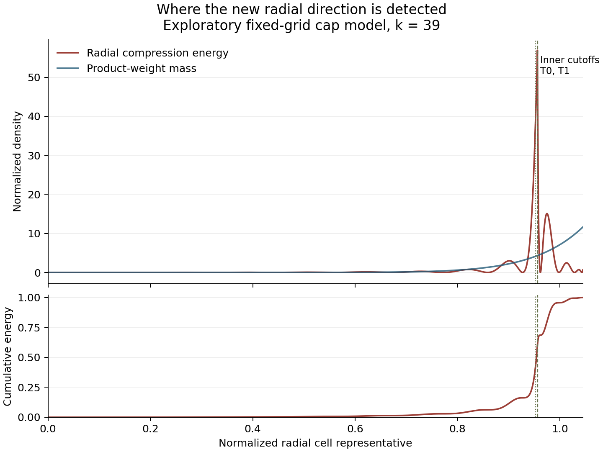

# Round 6: a full signed-operator direction beyond the 77-dimensional sieve trial

The new fixed-geometry k=39 cap trial has directly evaluated quotient **0.9944678209006830**, up from **0.9943963993644909** by approximately **71.4215 ppm**. This improvement comes from a direction generated by the full cap operator outside the old 77-dimensional space. A separate exact algebraic certificate proves that the frozen new direction is outside that space. The gain itself remains a floating-point result; the quotient is still approximately 5532.18 ppm below one, and the actual arithmetic support has not been restored. No smaller prime gap is proved.

This is the completed bounded diagnostic requested after [Round 5](prime186_round5.md). It is unrelated to the earlier finite zeta operator K_L. It neither repeats the same 77-by-77 eigenproblem nor performs another radius sweep.

## 1. Full operator, actual measure and signed weights

The source Hilbert space is \(\mathcal H=L^2(H_O,\nu^{\otimes39})\), where \(\nu\) is the finite fragment measure. It is not a probability measure conditioned on the outer domain. Profiles are extended by zero. Erasing coordinate i means

\[
(E_i f)(Y)=\int f(Y\oplus_i X)\,d\nu(X),\qquad
(E_i^*v)(X)=1_{H_O}(X)v(X_{\widehat i}).
\]

Freeze the original geometry, the exceptional constant 0.34 and all hybrid parameters. With

\[
a_h=0.9919601604,\quad b_h=-0.000843183,\quad d_0=0.0088830226,
\]

the full cap operator is

\[
T_{\rm cap}=\rho_*\sum_i E_i^*
(d_0 1_{H_{0,i}}+a_h1_{H_{1,i}}+b_h)E_i.
\]

This formula acts on arbitrary profiles in the Hilbert space; it is not a definition by a 77-dimensional matrix. The face multiplier takes values 1, \(a_h+b_h\), and the negative value \(b_h\). The operator is bounded and self-adjoint, with

\[
-\rho_*|b_h|C_{\rm op}I\le T_{\rm cap}\le\rho_*C_{\rm op}I,
\qquad C_{\rm op}\le4
\]

in the fixed support range. No positivity assumption is used.

The actual arithmetic operator additionally uses the complete inner predicates and the outer projection \(P_O\). Its supported quotient has denominator \(\|P_Of\|^2\). That denominator cannot be replaced by \(\|f\|^2\) unless f is already supported on O. A cap improvement, even one exceeding one, would still require this restoration step.

The [full derivation](../prime-gaps/round6/operator-proof/FULL_SIGNED_CAP_OPERATOR.md) checks the source measure, adjoints, boundedness, overlap integrals and the exact finite cell representation. For the fixed inward cap domains, profiles constant on total-cell/fragment-layer atoms form an invariant subspace of the full cap operator. Thus the step trial has no omitted within-atom action component. It can still have a large component outside the 77 polynomials. The actual tail/prefix support predicates require more fragment information and do not inherit that atom invariance.

## 2. A radial compression that exposes a new direction

Let U be the old 77-dimensional step-polynomial space, P its true mass-orthogonal projection, Q=I−P, and f the stored optimized trial. Put \(G=\prod_i g(t_i)\). Choose the closed subspace

\[
V=\{G\phi(s):\phi\text{ is arbitrary on a fixed selected set of radial cells}\}.
\]

U and V are not nested, and their projections need not commute. The construction is

\[
r=QTf,\qquad h=P_Vr,\qquad w=Qh.
\]

It follows exactly, for every f in U, that

\[
\langle f,Tw\rangle=\|h\|^2,\qquad
\|w\|^2=\|h\|^2-\|Ph\|^2.
\]

For unit f the two-dimensional off-diagonal entry is therefore

\[
\beta=\frac{\|h\|^2}{\|w\|},
\]

not simply \(\|w\|\). No exact Ritz assumption is needed, because the implementation computes \(PTf\) from the full mass projection \(M^{-1}Bc\), rather than replacing it with \(\lambda f\).

Writing q for the radial pushforward of \(1_{H_O}G^2\nu^{\otimes39}\), D for the basis cross-mass densities, and b for the pushed-forward pairing with Tf, the radial profile is

\[
\phi(s)=1_{\rm active}(s)\frac{b(s)-D(s)^{\mathsf T}M^{-1}Bc}{q(s)}.
\]

All fragment-cap layers and their signed face contributions are integrated before this projection. One-dimensional adjoint convolutions evaluate b. The single erased factor g, the reciprocal output factor \(1/g(t_i)\), the mesh factor and the common tilt normalization are retained. A normalized conditional average under \(g^2\nu\) would give a different operator.

The active radial set is frozen from the declared numerical cutoff. It defines V; the experiment does not claim that excluded cells carry no residual energy. In particular, a small excluded q-mass does not bound omitted \(\|r\|^2\).

## 3. A separate exact certificate of leaving U

The numerical norm calculation is not the only evidence that the new direction is outside U. The stored float64 profile is a specified finite list of exact dyadic rationals. Its entries at radial indices 0 through 12 are exactly zero, while

\[
\phi(18422)=-\frac{6264072493613325}{4611686018427387904}\ne0.
\]

Fix the other 38 coordinate cells at index zero and vary the first coordinate cell index r. After dividing by the common positive product G, each original basis function is a polynomial in r of degree at most 12: at most six from its radial power and at most six from its power-sum signature. If the frozen radial function belonged to U, the resulting polynomial would vanish at 13 distinct indices and hence everywhere, contradicting the displayed nonzero entry.

The argument concerns positive-measure product cells, not isolated points. Exact rational inequalities place every selected coordinate cell below the smallest cap and the whole product cell inside the first outer shell. Its measure is the positive number \(h_{\rm mesh}^{39}\). An [independent reviewer](../prime-gaps/round6/operator-diagnostic/OUTSIDE_SPAN_INDEPENDENT_REVIEW.md) decoded the binary NPZ directly and checked the nonzero rational and these support inequalities. That review verifies the polynomial-root argument; it does not independently rerun the additional modular-rank computation below.

A second finite certificate evaluates the old basis at 77 explicit positive-measure cells and obtains rank 77 modulo 1,000,000,007. The new radial column is zero at these cells and nonzero at the additional cell, proving rank 78 over the rationals. See [the certificate script](../prime-gaps/round6/operator-diagnostic/certify_outside_span.py) and [exact receipt](../prime-gaps/round6/operator-diagnostic/outside_span_certificate.json).

These certificates establish independence of the frozen functions. They do not bound the quantitative distance to U or certify the Rayleigh gain. Those remain separate integral questions.

## 4. What the bounded numerical experiment gives

For the official 98,304 grid, tilt 20 and density cutoff \(10^{-9}\):

| Quantity | Observed value |
|---|---:|
| Original 77-space matrix quotient a | 0.9943963991909279 |
| Radial compression norm squared | 0.00006670688589594228 |
| Outside-U norm squared | 0.00006589186717477095 |
| Fraction of radial norm squared remaining outside U | 0.9877820901062194 |
| Normalized new-direction diagonal b | 0.043583189070450945 |
| Actual normalized mixed entry beta | 0.008217784708256407 |
| Larger eigenvalue on span(f,w) | 0.9944674193880856 |
| Full 78-space matrix quotient | 0.9944678209367751 |
| Direct evaluation of the final profile | 0.9944678209006830 |

The simple two-dimensional gain is 71.0202 ppm. Reoptimizing the other coefficients adds approximately 0.40155 ppm. For the realized two-dimensional plane, crossing one would require \(\beta^2>(1-a)(1-b)\); the observed coupling squared supplies only about 1.26% of that threshold. This describes that plane, not the uncomputed full residual.

The [detailed report](../prime-gaps/round6/residual-trial/REPORT.md) preserves the coarse calculation and two controls. Tilt 20 and tilt 25 matrix values agree to approximately \(2.2\times10^{-16}\); their direct values differ by approximately \(1.53\times10^{-10}\). Changing the density cutoff from \(10^{-9}\) to \(10^{-8}\) shifts the result by about 0.0177 ppm. The old scaled mass Gram condition number remains approximately \(2.28\times10^{10}\). Small residuals and agreement between contractions are not outward rounding bounds.

A separate root process replayed the fine calculation in an isolated copy. Its matrix quotient, direct quotient, compressed norm, outside norm, coupling, active cells and radial profile agree exactly with the recorded run. That reproducibility does not replace interval certification.

## 5. Where this particular radial signal appears

The plot uses the saved arrays, with no new operator integration. Half the observed radial compression energy lies below normalized radius approximately 0.95403; its peak is approximately 0.95599, close to the inner cutoffs. The central half lies between approximately 0.94578 and 0.97133. This localization suggests examining the transitions of the face domains when designing a less restrictive compression, but does not establish a causal explanation. The comparison curve is the product-weight mass \(G^2\), not the optimized trial's \(f^2\) mass. This is the radial projection's energy, not the full residual's energy.

## 6. Independent checks, stored data and remaining work

The [independent residual audit](../prime-gaps/round6/residual-audit/SIEVE_RESIDUAL_AUDIT.md) gives the correct nonnested identities, approximate-Ritz corrections, inverse-Gram error formulas and signed crossing criteria. Eighty exact rational indefinite-operator examples and finite weighted-measure tests pass. A separately written [38-state marked model](../prime-gaps/round6/operator-diagnostic/FINITE_MARKED_OPERATOR_AUDIT.md) checks nonuniform product mass, nonrectangular support, noncommuting projections and an explicit negative quadratic witness. Neither toy model estimates the prime-sieve operator.

The [integration receipt](../logs/round6-integration/recheck.json) records exact replay of both algebraic test suites and the saved-output audit, followed by one fine-grid numerical replay. All original outputs are retained. Four compact NPZ witnesses publish every candidate and projection array except the reproducible 77-by-N D cache. The 183,046,525 bytes of original full NPZ files are preserved in the local archive; their hashes and array-by-array compaction checks are public. No coefficient, active cell, scalar result or new radial profile is omitted from the compact witnesses. The separate [archive check](../logs/round6-integration/archive_check.json) verifies all 37 verbatim intake files, all 44 retained arrays against the full originals, Python syntax, report links and an isolated replay of the exact independence certificate.

The earliest route to a rigorous variational gain would freeze rational coefficients and the radial profile, then enclose its ordinary mass and signed mixed forms directly. That would avoid depending on an exactly computed orthogonal projection. Since the current value remains below one, it would not itself yield a smaller prime gap. The next substantive decision is whether another implementable compression captures substantially more of the full cap residual, or whether a new support/product profile is needed. The full residual norm and the true support-restored form remain uncomputed. No further iteration is included in this checkpoint.
